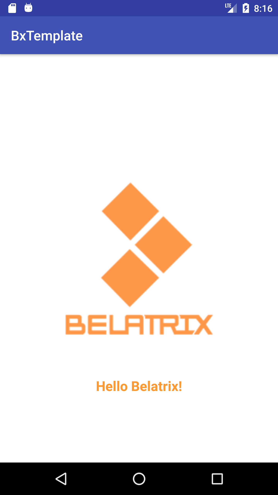

# FundamentalsOfMobileProgramming
Fundamentals of Mobile programming - Septiembre 2017

## Cronograma

 - Horario : sábados de 9 a 13hs.

 - Fecha de inicio: Sábado 23 de Septiembre.

 - Fecha de finalización: Sábado 07 de Octubre.

## Instructor

- nombre : Eduardo Medina
- email : emedinaa@gmail.com

## Temario

- Java Fundamentals , OOP (Object oriented programming) and threads.

- Android development, Fundamentals, Gradle , Android Studio and Material design.

- Android - User Interface(Layout and Widgets), User Events ,RecyclerView and Adapters.

- Android - Fragments, Navigation, Storage options and  Notification.

## Requisitos

- Entorno de desarrollo , usaremos el IDE Android Studio 2.3.3

- Instala Android Studio

  * Trabajaremos con la versión 2.3.3 de Android Studio,  que pueden descargar desde aquí https://developer.android.com/studio/index.html .

- Descargar los archivos

  * Si usas GIT , puedes descargar los archivos de la siguiente manera :

  ```
    git clone https://github.com/BelatrixTraining/FundamentalsOfMobileProgramming.git Template
  ```

  * O tambien puedes descargar los archivos en el siguiente link

  ```
  https://github.com/BelatrixTraining/FundamentalsOfMobileProgramming/archive/master.zip
  ```

 * Después de descargar y descomprimir el archivo, podemos encontrar lo siguiente :

  ```
    * BxTemplate
    * images
    * README.md
  ```


- Ejecutar el proyecto BxTemplate

  ```
    Run / Run App
  ```

<p align="center"></p>

### Referencias

- Página Oficial de Android https://developer.android.com/index.html
- Android Studio https://developer.android.com/studio/index.html
